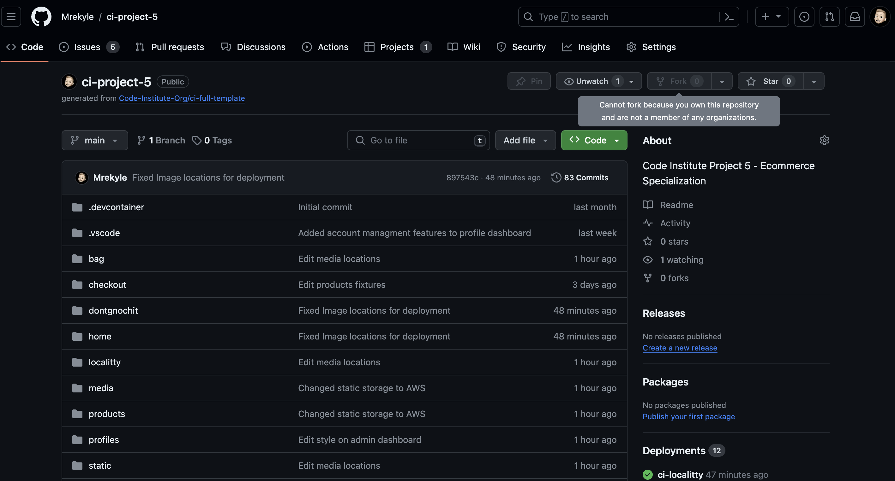

# Localitty

Link to live Localitty project: [Localitty - CI Project Five - Eccommerce Specialization](https://ci-localitty-e5ac9cc8af68.herokuapp.com/)

## Table of Contents 
1. The Project
    - Project Goals
    - Initial Design
2. Features
    - Implemented
    - Future Development
3. Business Plan
    - The plan
    - Media Page
4. Technology used
5. Testing
    - Manual
6. Bugs
7. Project Deployment
8. Sources
    - Code
    - Colors
    - Images

## The Project

### Project Goals

With the ever growing problems that arise in day to day life, people are turning towards wanting a fresh and local supplier for food. Instead of using the large chain supermarkets. Meaning people are becoming more conscious of how there food is grown and where it comes from. This opens the market for local suppliers.

But there has been no platforms for them to sell on, unless its at there store in person. This has inspired a centralized store for all things local. With local suppliers coming together to sell there goods. Localitty was born to fill this gap. 

Allowing users of the store to know that the goods they are purchasing are local to them, helping them to support local and eat fresh produce. 

With region expansion planned and product expansion planned. Localittys aim is to incorporate into every day life to supply local products to local people.

### Initial Design (Wireframes)

During the initial design phase of the project, wire frames were created to give a visual design idea and an end goal to work towards. With thought and care taken to make the design of the application as responsive and user friendly as possible for all device types. 
Whilst the wire frames may not be accurate to the final deployed project. The application has been adjusted to work and function correctly on all device types. The wireframes were designed to give a core design to the store.

Page Designs

 

### Home, Shop and User dashboard

The design was intended to be simple and intuitive for the user. To allow them to use the store as intended. Keeping it clean and simple at the same time as giving the user all the information they would need on that page.

###  Support, Dont GnocchIt and Admin Dashboard

Despite there being other pages on the application that are not included in the initial wireframe design. They all followed the core theme of the application and store. This allowed less going back and forth designing new pages in wireframe's, meaning the development of certain features and pages could commence straight away.

Database Diagram

 
With the design of the database being a crucial part of the applications core design it was important to get it right. 

Although not all designs are implemented into the live application is leaving room for future development with the implementation of 'user product rating and comments' and 'individual supplier stores' to allow them to manage their own products and sell on the platform.

## Future Development

### Implemented

The basic features that are currently implemented into the application are

- User Contact form
- User account creation
- User store functionality(add items to bag, checkout securely, receive order confirmation email)
- User to save information to their account
- User to see previous order history
- User to sign up for mailing list

- Admin CRUD (create, update and delete products)
- Admin Full Order history
- Admin total revenue, products and order count

### Future Development

Future features that are in development are

- Dark Mode
- Recipe/Developer Blogs
- Order History Filtering
- Vendor Accounts
- User product reviews and ratings
- Custom delivery schedule 
- Order dispatch emails
- Live Support Chats and messaging
- Locality Mobile App

## Business Plan

Locality's ultimate goal is to connect local farmers and producers of goods to the local people in a certain area. Allowing for the sustainable production of goods.

Promoting sustainable living, supporting locals and to have the best produce available to the customer. Locality's vision is to become the go to online retailer for local farmers/growers/producers to sell there goods to the local people.

As a company it is a priority for us to be a sustainable and environmentally friendly as possible. Due to the nature of making deliveries and using certain packaging. This has become a high priority for us. We can achieve this by:

- Packaging: Use eco-friendly packaging materials and encourage customers to recycle.
- Reducing Food Waste: Implement strategies to minimize food waste, such as donation programs and responsible inventory management.
- Deliveries: By using electric vans/Hybrid vans to make our deliveries

### Target Market:

- Locals in the Essex area who value fresh, locally sourced products.
- Health-conscious consumers seeking organic and sustainably produced goods.
- Busy individuals who prefer the convenience of online shopping without compromising product quality.

### Products and Services:

- Offer a wide and diverse variety of produce for locals
- Eventually offer subscription boxes and curated bundles to cater to specific preferences and dietary needs.

### Marketing:

- Digital Marketing: Utilize social media, SEO, and online advertising to reach and engage the target audience.
- Partnerships: Collaborate with local food bloggers and community organizations.
- Customer Loyalty Programs: Reward loyal customers with discounts, exclusive deals, and eventually referral programs.

### Operation Plan: 

- Relationships: Develop strong relationships with local farmers and producers. Also engaging in the local community with events to help promote eating/buying local.
- Inventory Management: Implement a robust inventory system to ensure freshness and minimize waste.
- Order Fulfillment: Building a team of local drivers to deliver our service in time frame we require to keep the customers happy. Ensuring they go the extra mile to assist customers when delivering our product.

As this is an ever growing business there is no set time line. Due to everything that can change on a weekly basis with the nature of the service that is offered. 

But by rolling our in phases we are able to cut the chance of things going wrong drastically. Starting by launching our core products in Essex. Having them become established as a service and getting everything right. Before eventually expanding to different regions and areas, forming new relationships with farmers/artisans/bakers/producers around the country.

## Media Page

An online presence for a new business is a crucial part of the launch of a new company. As this promotes to a wide audience of people in a targeted area. 
 

Media Page

 

## Technology Used

During the development of the app multiple different types of technology was used and utilized to build the final application. 

- HTML - Was used to create the basic web page for the project
- CSS - Was used to style the web page and the different elements that make up the application
- JS - Was used to create a few simple functions for ease of use. Such as changing the date in the footer.
- Python - Used during the development of the back end of the application for everything that communicates with different servers and databases
- Django - Was used as the base development framework. Allowing the use of template and and back end driven development. 
- Bootstrap - Was used to speed up development time due to the vast array of helper classes and systems they have in place. And with the various free templates and code snippets they offer to their users.
- AWS - Used to hose the static files for the application (Media files and Static Files)
- ElephantSQL - Was used for the hosting of the database that contains all the products on the application
- Github - Was used for source control of the project allowing progress of the application to be tracked and stored in one place
- Gitpod - Was used as an IDE. Allowing for the development of the application anywhere anytime
- Heroku - Was used to host the application on the internet for all to use and see

## App Testing

During the development of the Project it has been subjected to different testing methods to ensure that all points are hit. No errors are found in the code as well as manual testing of the app to ensure everything works as intended. There was also testing involved to ensure that the application would be responsive and work on all screen sizes and device types by using the built in google chrome developer tools. To allow for the best accessability possible. The image for this can be found at the top of the document.

| Test | Intended Result | Result |
|------|-----------------|--------|
| Account Creation | Allows the user to create an account and confirm their email address | Passed |
| Change Password | Allows the user to change their password | Passed |
| Email Verification | Allows the user to verify their email address | Passed |
| Change Email | Allows the user to change or update their email | Passed |
| Item rating | Allow the user to select a rating on the item | |
| Item Comments | Allows users to comment on the item to tell other users about the item | |
| Item Favorites | Allows the user to 'favorite' an item for quick access later on | | 
| Select Quantity | Allows the user to adjust quantity of items to add to the bag | Passed |
| Add items to bag | Allow the user to add items from the store to the bag | Passed |
| Bag items edit | Allow the user to change item quantity and remove items from the shopping bag | Passed |
| Secure Checkout | Allows the user to add their billing information securely into the app | Passed
| Checkout | Allow the user to checkout securely checkout and process the order | Passed |
| Order Creation | Order is created inside of the database | Passed |
| Order Confirmation | Displays the order confirmation to the user with the correct order number | Passed |
| Order History | Allow the user to see their previous order history | Passed |
| Order Confirmation Email | Sends the order confirmation emails to the user (Including all items in order) | Passed |
| Save info | Allow the user to save default shipping information to their profile | Passed |
| Support | Allow the user to send a support contact form request | Passed |
| Admin Order History | Allow the store admins to view all order history | Passed |
| Admin product create | Allow the store admins to create products on the store | Passed |
| Admin product edit | Allow the store admins to edit current products on the store | passed |
| Admin product delete | Allow the store admins to delete current products on the store | Passed |
| Total Store Items | Allows the Admin to see the total number of items in the store | Passed |
| Total Revenue | Allow the store admins to view the total store revenue | Passed |

 

Lighthouse

 
Although only one image is shown of a lighthouse score. The average score across the site is 75 to 80 of total performance

 

Css Testing

 
Despite there being errors in the validation. I believe this is due to the validation service not being updated for newer versions of css.

 

Javascript Testing

 
Despite there being warnings on the JS testing. This is due to missing semi colons and JSON syntax not being recognized. Not causing any code breaking bugs.
 

 

Pep8

 

As far as I am aware there is no real pep8 validation service that I have been able to fine. All the testing I have done for this is in the built in problems tab in VsCode/Gitpd. Not throwing any problems apart from unknown words that I have chosen for class names. Or names through out the project.

 

## Bugs

During the development of the application there were many different bugs along the way. From a simple syntax error to an application breaking bug. Some of them are in the table below.

| Bug | Fix |
|-----|-----|
| Profiles Modules not being found | Fixed by re ordering the urls in the main application files |
| Product filtering selection not displaying on the selection box. But filtering products | Unfixed |
| Product Quantity selection not working. Page refreshing on button click | Small typos in the JS file |
| Orders not being saved to the database. But being sent to stripe | Connected to other small bugs. But fixed by fixing a typo with the UUID generation |
| Checkout success page not loading | Error in the name of the checkout success page file name |
| Pagination errors. Cant paginate an un ordered list | Fixed by adding the order_by() method onto the selector |
| Confirmation emails not being sent during development | Due to stripes webhook handlers not working in development on a local host. But working when deployed |
| Delivery costs not calculating correctly | Fixed by changing the percentage to be divided by |
| Product category not displaying on product card in store page | Unfixed |
| Delivery Charge not calculating correctly at checkout | Due to total amount not being divided inside of the contexts |

## Project Deployment

Heroku was used to deploy the application live to the internet. The live Application can be found here.
  
[Localitty](https://ci-localitty-e5ac9cc8af68.herokuapp.com/)

Elephant SQL Deployment

The database behind Localitty was done by utilizing the free tier of SQL from ElephantSQL. By following the below steps you can see how the database was created and in the following Heroku deployment steps. You can see how they are linked together to work with each other. 

### Step One

### Step Two 

Heroku Deployment

Heroku is used as a way for developers and companies to deploy and manage their websites with ease. Allowing the easy connection of things such as databases and media storage. 

### Step One

### Step Two 

With the use of Config Variables, it is telling the web server where certain locations of things such as databases, media storages, email services etc.. Giving the required information for that service to be used.

### Step Three 

Linking the Heroku app to the Github repo allows for smoother and automatic deployments. Directly from pushing an update to github, the Heroku Service will automatically build a new version and deploy with web app.

If you are wanting to take a look at the code and potentially add on your own features to the project you can do so by cloning or forking the repo. By doing this it will allow you to locally develop and add your own features to the app.

Clone and Forking

 

By clicking the clone repo button. You are able to then clone the repo as it is. By clicking the fork button you are able to take the code and add it to your own account where you can develop and push new and improved features to the main application. 

## Sources

### Code

All code for the project was written by myself. Whilst using Stack Overflow, Google, various Youtube videos and Code Institute Slack Chats for reference and problem solving. Also being aware of the Code Institutes 'Botique Ado' Walkthrough for code reference and guidance along the way

Also using various code samples Bootstrap library of free sample code

### Colors 

The colors that were chosen for the project were picked because they were all simple yet bold colors. All contrasting each other allowing for an easy to read/view application. 

Color Palette

### Images

All images that are found in the application on all pages are from a selection of websites. That are listed below.

- Pexels - Royalty Free Images
- FedFedFed - Online food retailer
- Google Image Search
- The Fruit and Veg Man
- Meatless Farms
- Blackwells Butchers
- The Cornish Fish Monger

### Favicon 

Favicon was generated using favicon.io

